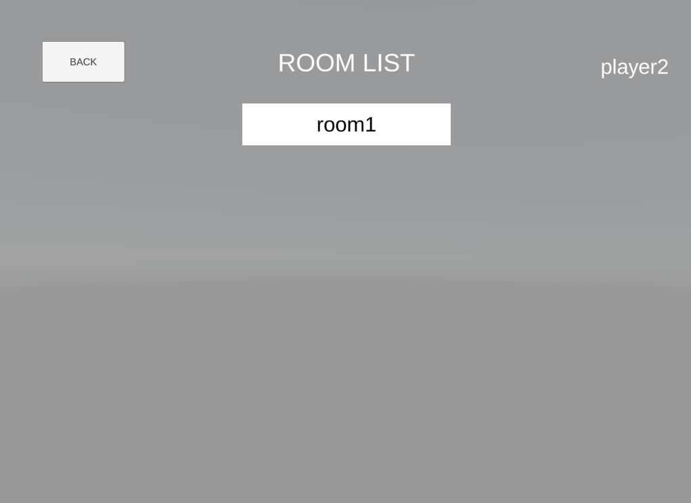
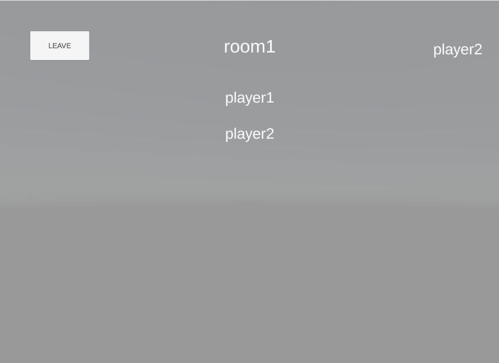

# OnlineFPS

Developing a Multiplayer FPS game with Unity and Photon PUN 2.

FPS animations and mechanics are taken from Unity Asset Store. Pakcage name is "Low Poly FPS Pack - Free (Sample)".

Networking is divided into two parts: Lobby and In-Game.
Ingame networking code is mainly handled by FPSController, NetworkRoomManager, and NetworkCommunicationManager scripts.
Networking in the lobby is mainly handled by NetworkManager script and UI elements.

Currently, basic client-side interpolation/reconciliation and small lag compensation methods are implemented.

More sophisticated implementations will be made over time.

How to Play:

After getting into lobby MasterClient starts the game with the Start button.
When every player is connected and synced with each other, every player is moved into a random location.

Use W,A,S,D keys to move and LShift to sprint.
Use LMB to single shoot and RMB to aim.
Use 1 and 2 keys change weapon.

For decals small red spheres are used.

Players are killed with one shot. When a player dies, respawns after 1.5 second.

In-Game Screeshoots and Footage:
Room List Example when clicked Join:

Example of Room:

https://user-images.githubusercontent.com/47023800/121573155-94940600-ca2d-11eb-8799-f755174bb7c9.mov
